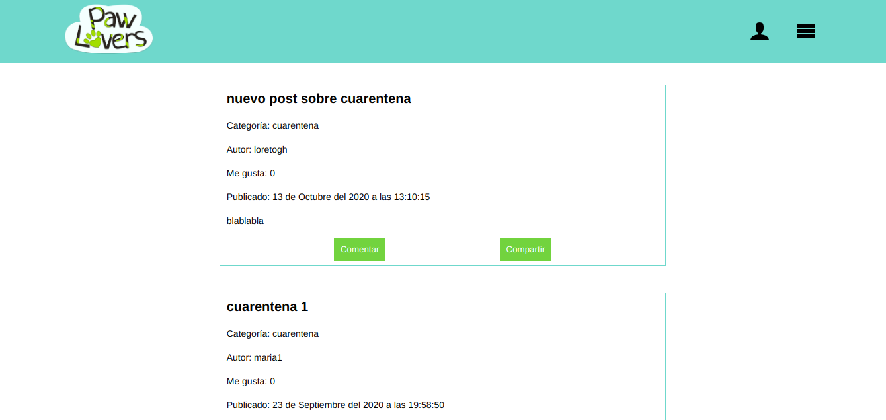
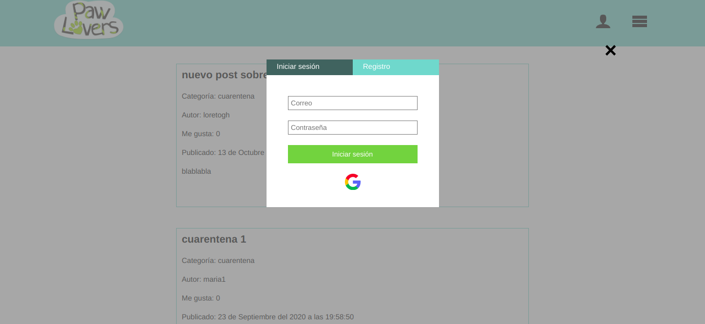
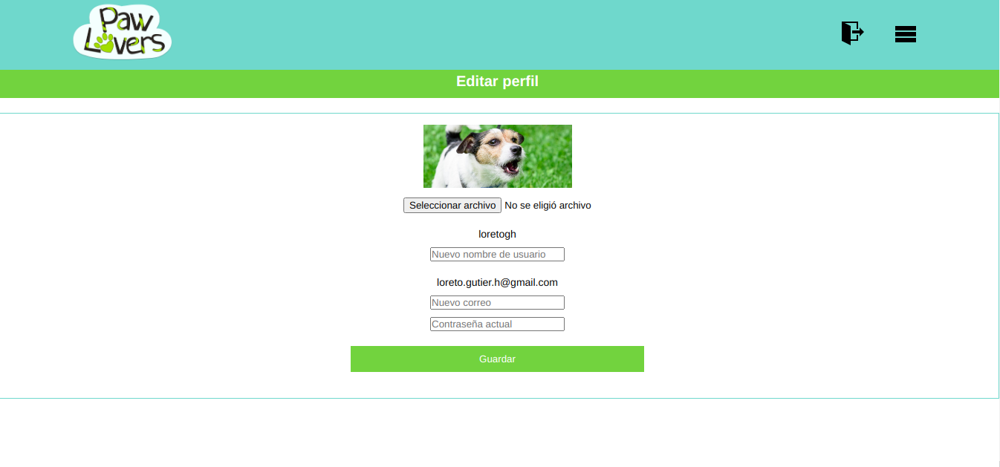

## Paw Lovers

[haz clic aquí para ir a la aplicación](https://paw-lovers-2.web.app/).

Esta es la versión 2.0 de Paw Lovers, una red social para amantes de los animales.

Por el momento sus funcionalidades son las siguientes:

*Crear cuenta de usuario con correo y contraseña

*Iniciar sesión con correo y contraseña o la cuenta de Google

*Ver publicaciones sin necesidad de iniciar sesión

*Crear publicaciones (solo usuarios conectados)

*Editar publicaciones (solo permitido para el autor de la publicación)

*Eliminar publicaciones (solo permitido para el autor de la publicación)

*Dar "Me gusta" o quitar "Me gusta"

*Editar información de usuario (foto de perfil, nombre de usuario y correo electrónico) en el panel de control que está disponible para los usuarios conectados

*Responsive (portrait mobile, tablet, desktop)

Tecnologías utilizadas:

*HTML5

*CSS3

*Flexbox

*Javascript

*React

*Redux

*Firebase

Para ver la versión 1.0 de Paw Lovers (con Vanilla JS) [haz clic aquí](https://lirizo.github.io/SCL013-social-network/src/index.html#/mas-sobre-PL)

